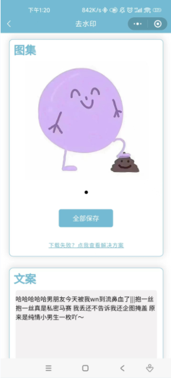

# wxxcx_django_qsy
Python的Django开发的短视频去水印小程序源码【后端Python】

支持抖音、快手、小红书、左右、皮皮搞笑等20余主流短视频平台视频和图文解析~

部署参考：https://blog.51cto.com/u_16213609/7715201

本人联系方式：976870170

微信：python_kk

1、为什么要开发这个小程序？
2023最新短视频去水印微信小程序有流量主，后端Python，可做毕设课设可上线部署服务器，纵观全网，Python后端开发的小程序实在是太少了，up经过一周时间开发了一个微信小程序+Django后端的去水印小程序
特点：去水印微信小程序+Django后端+Mysql后端+最新去水印接口

2、小程序部署上线演示

流量主功+图文解析+视频解析功能完美运行

3、Python Django Web后台演示

Django后台拥有修改接口功能，涵盖小程序轮播、公告、接口（暂时没开发自定义接口）、流量主

（1）、Web后台可修改小程序轮播图

（2）、Web后台可修改小程序公告

（3）、Web后台可修改小程序接口秘钥

（4）、Web后台可修改小程序流量主代码

4、小程序演示：

搜索微信小程序：科科666

本人联系方式：976870170

微信：python_kk

需要搭建可以找我~

需要接口可以找我~

5、如何部署服务器（如果不会部署的可以帮部署、联系微信python_kk）

(./1)域名解析那里解析一个域名,我这里举例

https://test.abc.com

(./2)打开宝塔面板

点击添加站点 把 test.abc.com输入 数据库不用选 php不用选，PHP版本选择静态

（3）上传后端源码

解压压缩包

修改wsgi文件，记住只需要改 chdir static-map 两个地方就可以了

换句话来说，只需要把域名换了就行，因为这里的目录名称就是域名，换成自己服务器域名就可以，因为小程序需要请求域名

(./4)申请一下https证书

(./5)安装一下Python项目管理

（6）通过Python项目管理器添加项目

find / -name activate

这里的启动文件/文件夹一定要找到 wsgi.py文件！！！！！！！

python版本一定要选择3.6.8切记！！！！！！！！！！！！！！！！！！！

一般阿里云自带就是 3.6.8

不然可能项目代码报错或者sqlite数据库报错

(./7)打开nginx配置文件，配置域名

vim /www/server/nginx/conf/nginx.conf

看清楚配置文件位置，把所有域名换成自己的 两个证书文件 一个服务器域名位置

    server {
        listen       80;
        listen       [::]:80;
        listen 443 ssl http2;
        ssl_certificate    /www/server/panel/vhost/cert/test.xxxx.com/fullchain.pem;
        ssl_certificate_key    /www/server/panel/vhost/cert/test.xxxx.com/privkey.pem;
        server_name  test.xxxx.com;
        location / {
             uwsgi_pass 127.0.0.1:8001;
             include /www/server/nginx/conf/uwsgi_params;
        }
    }

配置完成以后 退出来 nginx -t 测试有问题不

nginx: the configuration file /www/server/nginx/conf/nginx.conf syntax is ok
nginx: configuration file /www/server/nginx/conf/nginx.conf test is successful

没有问题 nginx -s reload 重启nginx

访问域名 test.abc.com

如果不能访问

通过 source /www/wwwroot/test.abc.com/c18150a64f095993d7c2da9a51bdadae_venv/lib/python3.6/venv/scripts/common/activate 进入虚拟环境看了一下依赖包一个没有安装我们手动安装

cd /www/wwwroot/test.abc.com

pip3 install -r requirements.txt

